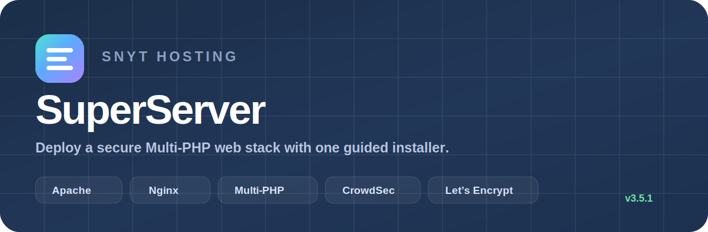
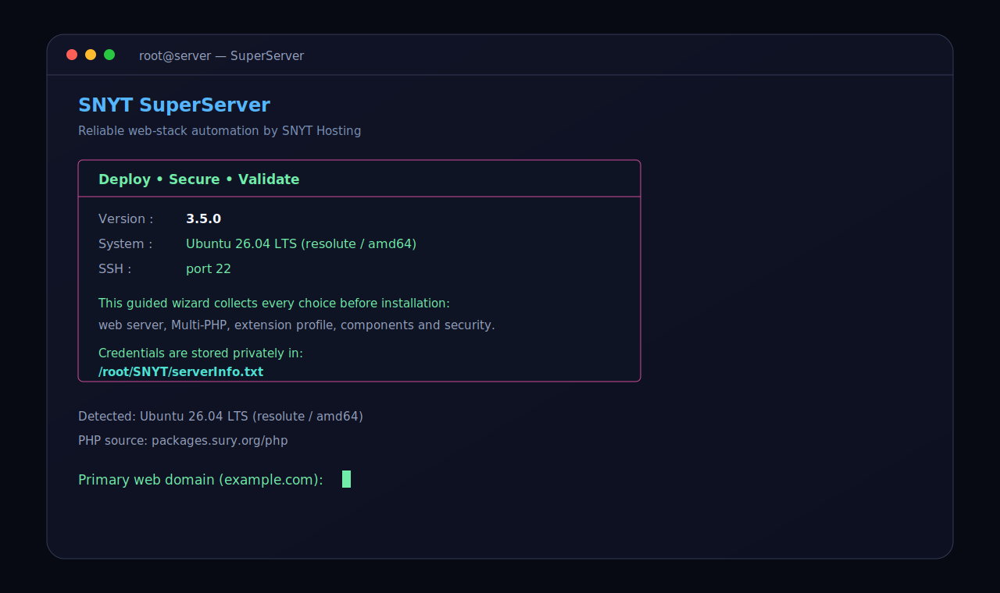
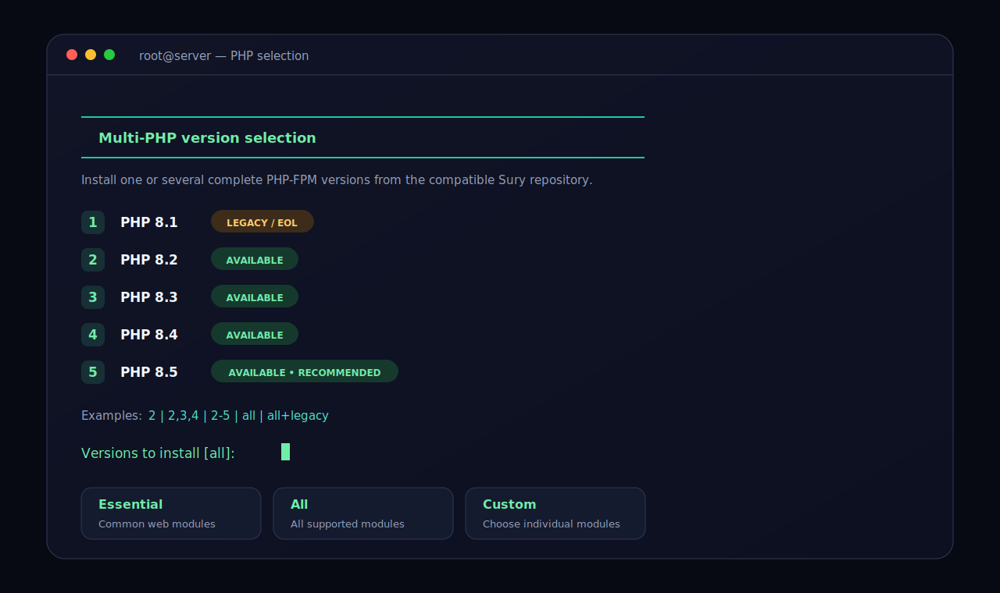
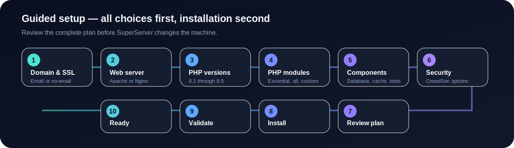
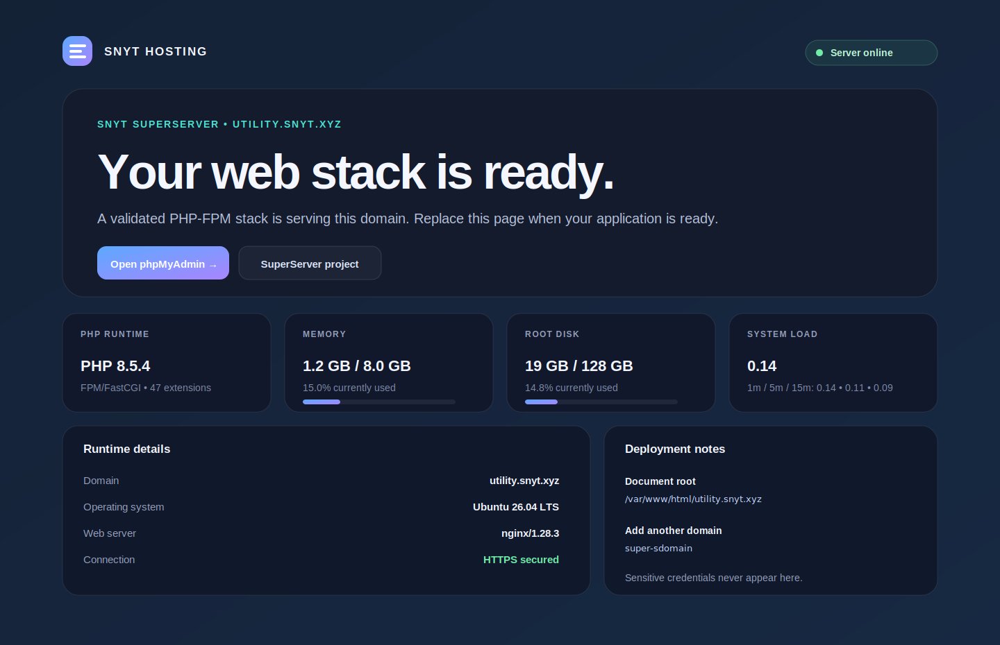

<p align="center">
  
</p>

<p align="center">
  <a href="https://github.com/abdomuftah/SuperServer/releases"></a>
  <a href="https://github.com/abdomuftah/SuperServer/actions/workflows/validate.yml"></a>
  
  
  
  <a href="./LICENSE"></a>
</p>

<p align="center">
  <strong>A guided installer for Apache or Nginx, Multi-PHP, MariaDB, Redis, CrowdSec, Let’s Encrypt, and the tools needed to deploy modern web applications.</strong>
</p>

<p align="center">
  <a href="#-quick-install">Quick Install</a> ·
  <a href="#-what-it-installs">Features</a> ·
  <a href="#-installer-experience">Screenshots</a> ·
  <a href="#-multi-php">Multi-PHP</a> ·
  <a href="#-security">Security</a> ·
  <a href="#-management-commands">Management</a>
</p>

---


> [!TIP]
> **Wizard-first behavior:** SuperServer now collects every choice before running `apt`, changing repositories, or installing services. Multi-select screens use terminal checklists: move with **↑/↓**, toggle with **Space**, and confirm with **Enter**.

> [!NOTE]
> In non-interactive shells or terminals without cursor controls, SuperServer automatically falls back to number and range input.

## 🚀 Quick install

> Run SuperServer on a clean Ubuntu or Debian server as `root`.

```bash
sudo -i
cd /root
curl -fsSL https://raw.githubusercontent.com/abdomuftah/SuperServer/main/SuperServer.sh -o SuperServer.sh
chmod 700 SuperServer.sh
bash -n SuperServer.sh
./SuperServer.sh
```

For an unstable SSH connection, run it inside `screen`:

```bash
apt update && apt install -y screen
screen -S superserver
./SuperServer.sh
```

Detach with `Ctrl+A`, then `D`. Return later with:

```bash
screen -r superserver
```

> [!IMPORTANT]
> Point the primary domain’s DNS record to the server before requesting the Let’s Encrypt certificate.

---

## ✨ What it installs

<table>
<tr>
<td width="50%" valign="top">

### Web stack

- Apache **or** Nginx
- PHP-FPM 8.1 through 8.5
- Per-domain PHP version selection
- Essential, All, or Custom PHP modules
- Composer
- Node.js, npm, and optional PM2
- Python development tools
- Optional Java JDK

</td>
<td width="50%" valign="top">

### Services and security

- MariaDB
- Redis Server
- Optional phpMyAdmin at `/phpmyadmin/`
- Let’s Encrypt SSL and automatic renewal
- UFW firewall
- CrowdSec Security Engine
- CrowdSec firewall bouncer
- Optional Nginx AppSec/WAF
- Optional Docker Engine and Compose

</td>
</tr>
</table>

SuperServer generates private credentials, stores the approved installation plan, installs the selected components, and validates the completed stack before reporting success.

---

## 🖥️ Installer experience

All questions are collected **before installation begins**. After you approve the final plan, SuperServer continues without interrupting you for more input.

<table>
<tr>
<td width="50%" valign="top">
  
  <p align="center"><sub>Clean welcome screen with detected system information.</sub></p>
</td>
<td width="50%" valign="top">
  
  <p align="center"><sub>Visible Multi-PHP choices and module profiles.</sub></p>
</td>
</tr>
</table>

<p align="center">
  
</p>

The wizard asks for:

1. Primary domain
2. Real SSL email or no-email registration
3. Apache or Nginx
4. PHP versions and default PHP
5. PHP extension profile
6. phpMyAdmin and optional components
7. CrowdSec protection level
8. Final installation-plan review

The approved plan is saved to:

```text
/root/SNYT/install-plan.conf
```

---

## 🌐 Modern default page

Every newly created domain receives a responsive `index.php` template with runtime status, PHP details, memory and disk usage, system load, SSL state, uptime, and deployment paths.

<p align="center">
  
</p>

Sensitive credentials are never displayed on the page.

---

## 🐘 Multi-PHP

SuperServer configures the compatible [Sury PHP repository](https://packages.sury.org/php/) and checks every selected PHP version before installation.

| Version | Label | Selection behavior |
|:--:|---|---|
| PHP 8.1 | Legacy / EOL | Explicit selection or `all+legacy` |
| PHP 8.2 | Compatibility | Included in `all` when available |
| PHP 8.3 | Supported | Included in `all` |
| PHP 8.4 | Supported | Included in `all` |
| PHP 8.5 | Newest | Recommended default |

Selection examples:

```text
2
2,3,4
2-5
all
all+legacy
```

`all` installs PHP 8.2–8.5. `all+legacy` also includes PHP 8.1.

### PHP-FPM only

Both Apache and Nginx use PHP-FPM sockets. SuperServer intentionally avoids `libapache2-mod-php`, preventing competing PHP handlers and preserving per-domain PHP selection.

---

## 🧩 PHP extension profiles

<details open>
<summary><strong>Essential</strong> — recommended for most websites and applications</summary>

```text
cURL, MySQL / PDO MySQL, Mbstring, XML, ZIP,
Intl, GD, BCMath, OPcache and Readline
```

</details>

<details>
<summary><strong>All</strong> — installs every extension supported by SuperServer</summary>

```text
Essential modules, Redis, SQLite3, SOAP, BZip2,
Imagick, Tidy, XML-RPC, GMP, LDAP, IMAP, SNMP and APCu
```

</details>

<details>
<summary><strong>Custom</strong> — select the modules required by your application</summary>

The installer presents a numbered menu and accepts values such as:

```text
1-10,12,15
```

Core packages are always installed:

```text
phpX.Y-cli
phpX.Y-common
phpX.Y-fpm
```

Some module names are provided by grouped packages:

- `phpX.Y-xml` provides DOM, SimpleXML, XML and XSL.
- `phpX.Y-common` provides ctype, fileinfo, iconv and tokenizer.

</details>

---

## ⚖️ Apache or Nginx

| Capability | Apache | Nginx |
|---|:---:|:---:|
| `.htaccess` support | ✅ | — |
| PHP-FPM per domain | ✅ | ✅ |
| Traditional PHP hosting | Excellent | Excellent |
| Reverse proxy and Docker front-end | Good | Excellent |
| CrowdSec firewall protection | ✅ | ✅ |
| CrowdSec AppSec/WAF | Firewall mode | Optional AppSec mode |

Choose Apache for `.htaccess` compatibility and traditional hosting workflows. Choose Nginx for reverse proxying, Docker applications, and lightweight high-performance deployments.

---

## 🛡️ Security

SuperServer can configure:

- UFW with the detected SSH port
- Let’s Encrypt SSL and renewal testing
- CrowdSec Security Engine
- CrowdSec firewall bouncer
- Linux and SSH log collections
- Apache or Nginx log collection
- Optional Nginx AppSec/WAF
- Automatic security updates

CrowdSec commands:

```bash
cscli metrics
cscli decisions list
systemctl status crowdsec
systemctl status crowdsec-firewall-bouncer
```

### Let’s Encrypt contact

The wizard offers two choices:

```text
1) Use a real email address
2) Register without an email address
```

SuperServer does not generate fake email addresses. New domains inherit the main server’s SSL registration mode automatically.

---

## 🗃️ phpMyAdmin

phpMyAdmin is optional. When enabled, its address remains predictable:

```text
https://example.com/phpmyadmin/
```

It uses the selected default PHP-FPM version. Selecting phpMyAdmin automatically enables MariaDB.

---

## 📦 Optional components

| Category | Components |
|---|---|
| Database and cache | MariaDB, Redis Server, phpMyAdmin |
| Development | Composer, Node.js and npm, PM2, Python tools, Java JDK |
| Containers | Docker Engine and Docker Compose |
| System | Automatic security updates, SNYT Fastfetch and MOTD |

Available presets:

```text
recommended
all
none
```

---

## ➕ Add another domain

```bash
super-sdomain app.example.com
super-sdomain app.example.com 8.2
super-sdomain --list-php
```

Each new domain receives:

- Its own Apache VirtualHost or Nginx server block
- The selected PHP-FPM version
- A modern `index.php` page
- Let’s Encrypt using the stored main-domain contact mode

The helper reads SSL settings from:

```text
/root/SNYT/serverInfo.txt
```

---

## 🧰 Management commands

Launch the interactive helper:

```bash
super-server
```

Or use direct commands:

```bash
super-server status
super-server doctor
super-server domains
super-server php
super-server ssl
super-server restart
super-server info
```

`super-server info` automatically redacts password values.

---

## 📁 Important paths

| Purpose | Path |
|---|---|
| Credentials and server details | `/root/SNYT/serverInfo.txt` |
| Approved installation plan | `/root/SNYT/install-plan.conf` |
| Added-domain history | `/root/SNYT/domains.txt` |
| Installation log | `/var/log/snyt-superserver.log` |
| Shared templates | `/usr/local/share/snyt-superserver/` |
| Domain helper | `/usr/local/sbin/super-sdomain` |
| Management helper | `/usr/local/sbin/super-server` |

> [!CAUTION]
> Keep `/root/SNYT/serverInfo.txt` private. It may contain generated MariaDB credentials.

---

## ✅ Validation

Before reporting success, SuperServer checks:

- Every selected PHP CLI binary
- Every selected PHP-FPM service and socket
- Selected PHP extensions
- The default CLI PHP version
- PHP delivery through Apache or Nginx
- Web-server configuration syntax
- MariaDB, Redis, Node.js, Python, Composer, Docker, and CrowdSec when selected
- Let’s Encrypt renewal using a dry run after certificate issuance

Local repository validation is provided by:

```text
.github/workflows/validate.yml
```

---

<details>
<summary><strong>🧪 Recommended test matrix</strong></summary>

```text
Ubuntu 26.04 + Nginx + PHP 8.2/8.3/8.4/8.5
Ubuntu 26.04 + Apache + PHP 8.2/8.4/8.5
Ubuntu 24.04 + Nginx + Essential modules
Ubuntu 24.04 + Apache + All modules
Custom PHP extension profile
No-email SSL mode
phpMyAdmin disabled
CrowdSec firewall mode
Nginx CrowdSec AppSec mode
Docker selected and unselected
```

Take a clean VM snapshot before every installation test.

</details>

<details>
<summary><strong>📚 Upstream documentation</strong></summary>

- [Sury PHP repository](https://packages.sury.org/php/README.txt)
- [CrowdSec Linux installation](https://docs.crowdsec.net/u/getting_started/installation/linux/)
- [CrowdSec firewall bouncer](https://docs.crowdsec.net/u/bouncers/firewall/)
- [CrowdSec Nginx bouncer](https://docs.crowdsec.net/u/bouncers/nginx/)
- [Certbot documentation](https://eff-certbot.readthedocs.io/en/stable/using.html)
- [PHP supported versions](https://www.php.net/supported-versions.php)

</details>

---

<p align="center">
  Built with care by <strong>SNYT Hosting</strong><br>
  <sub>Deploy • Secure • Validate</sub>
</p>
