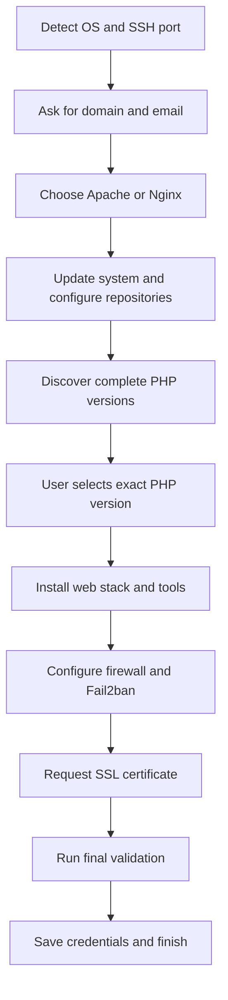

<div align="center">

# ⚡ SNYT SuperServer

### A modern, guarded web-stack installer for Ubuntu and Debian

Choose **Apache or Nginx**, install an exact **PHP-FPM version**, secure the server, and finish with a validated production-style web stack.

[](CHANGELOG.md)
[](SuperServer.sh)
[](#-supported-systems)
[](#-supported-systems)
[](LICENSE)

<br>

> **SuperServer keeps the project simple:** one readable Bash installer, a small assets directory, clear logs, and no hidden control panel.

</div>

---

## ✨ What SuperServer does

<table>
<tr>
<td width="50%" valign="top">

### 🌐 Web stack

- Friendly **Apache / Nginx** selection
- Exact PHP version selection
- PHP-FPM for both web servers
- MariaDB and phpMyAdmin
- Redis
- Certbot and automatic renewal

</td>
<td width="50%" valign="top">

### 🧰 Development tools

- Composer
- Current Node.js LTS with fallback
- PM2
- Python and pip
- Django
- Java Development Kit
- Git and common build tools

</td>
</tr>
<tr>
<td width="50%" valign="top">

### 🛡️ Security

- UFW firewall
- Automatic SSH-port detection
- Fail2ban
- unattended-upgrades
- Random database credentials
- Restricted credential and log files

</td>
<td width="50%" valign="top">

### 🖥️ Server experience

- SNYT Fastfetch configuration
- Custom SNYT MOTD
- Detailed installation log
- Final service validation
- `super-sdomain` add-domain helper
- Safe previous-installation guard

</td>
</tr>
</table>

---

## 🆕 Version 3.2.0 highlights

This release focuses on **web-server choice and PHP reliability**.

### Clear Apache or Nginx selection

The installer explains both choices before continuing:

```text
Choose your web server

1) Apache
   Best for WordPress, .htaccess and compatibility.

2) Nginx
   Best for reverse proxies, Docker applications and a lightweight stack.
```

The choice is confirmed and stored in:

```text
/root/SNYT/serverInfo.txt
```

### Complete PHP version discovery

Older releases checked only whether `phpX.Y-cli` existed. That could expose a PHP version whose FPM service or required extensions were unavailable.

SuperServer 3.2.0 shows a PHP version only when all of these packages have installable candidates for the **same version**:

```text
phpX.Y-cli
phpX.Y-common
phpX.Y-fpm
phpX.Y-curl
phpX.Y-mysql
phpX.Y-mbstring
phpX.Y-xml
phpX.Y-zip
phpX.Y-intl
phpX.Y-gd
phpX.Y-bcmath
phpX.Y-opcache
```

Optional extensions are installed only when available:

```text
redis  sqlite3  soap  bz2  imagick  tidy
```

### No generic PHP meta package

SuperServer deliberately avoids installing the generic `phpX.Y` meta package. On some releases, that package can pull an unwanted Apache module or a distribution-default PHP stack.

Instead, SuperServer installs the selected CLI, FPM and extension packages explicitly.

### Runtime validation

The installer confirms all of the following before declaring success:

- CLI reports the selected PHP version.
- The matching PHP-FPM service is active.
- The matching FPM socket exists.
- Required extensions are loaded.
- Apache or Nginx serves a temporary PHP check using the selected version.
- MariaDB, Redis and Fail2ban are active.
- Web-server configuration syntax is valid.

---

## ✅ Supported systems

| Distribution | Releases | Architecture |
|---|---|---|
| Ubuntu Server | 22.04 LTS, 24.04 LTS, 26.04 LTS | amd64, arm64 where upstream packages exist |
| Debian | 11 Bullseye, 12 Bookworm, 13 Trixie | amd64, arm64 where upstream packages exist |

The installer detects the distribution, release codename and architecture automatically.

External repositories are added only when their release metadata exists for the detected codename. Otherwise, SuperServer falls back to distribution packages instead of leaving APT broken.

> [!IMPORTANT]
> Use a clean VM or server and take a snapshot before testing a new SuperServer release. Compatibility code does not replace real validation on every target operating system.

---

## 🚀 Installation

### 1. Become root

```bash
sudo -i
```

### 2. Download the installer

```bash
wget https://link.snyt.xyz/SuperServer -O SuperServer.sh
chmod 700 SuperServer.sh
```

### 3. Check the script before running it

```bash
bash -n SuperServer.sh
./SuperServer.sh --version
sha256sum SuperServer.sh
```

### 4. Start the installer

For long SSH sessions, using `screen` is recommended:

```bash
screen -S superserver
./SuperServer.sh
```

Detach without stopping the installation:

```text
Ctrl+A, then D
```

Return later:

```bash
screen -r superserver
```

---

## 🧭 Installation flow



---

## 🌐 Apache or Nginx?

| Choose | Best suited for | Notes |
|---|---|---|
| **Apache** | WordPress, `.htaccess`, traditional PHP sites, broad compatibility | Uses PHP-FPM through `proxy_fcgi`; SuperServer does not use mod_php |
| **Nginx** | Reverse proxy, Docker services, APIs, Laravel, lightweight utility servers | Uses the selected PHP-FPM Unix socket directly |

SuperServer installs only the selected web server. If the other server is already installed, the installer stops instead of removing it automatically.

---

## 🐘 PHP selection

Available choices are generated from the current APT repositories. A typical menu may look like:

```text
Only complete PHP versions are shown.

1) PHP 8.5  (newest complete version)
2) PHP 8.4
3) PHP 8.3
4) PHP 8.2  (legacy compatibility)
```

The exact list depends on the operating system and repositories available at installation time.

After selection, SuperServer records:

```text
Selected PHP Version: 8.x
PHP-FPM Service: php8.x-fpm
PHP-FPM Socket: /run/php/php8.x-fpm.sock
```

---

## 📦 Installed software

| Category | Components |
|---|---|
| Web | Apache **or** Nginx, PHP-FPM, common PHP extensions |
| Database | MariaDB, phpMyAdmin |
| Cache | Redis |
| JavaScript | Node.js LTS, npm, PM2 |
| Python | Python 3, pip, Django |
| Development | Composer, Java, Git, GCC, G++, Make |
| TLS | Certbot and the selected web-server plugin |
| Security | UFW, Fail2ban, unattended-upgrades |
| Terminal | Fastfetch, Figlet, SNYT MOTD |

---

## 🔐 Credentials and sensitive files

SuperServer generates random database credentials and does not print passwords in the final terminal summary.

### Credentials

```text
/root/SNYT/serverInfo.txt
```

Permissions:

```text
/root/SNYT                 700
/root/SNYT/serverInfo.txt  600
```

MariaDB root keeps Unix-socket authentication:

```bash
sudo mariadb
```

phpMyAdmin uses the generated administrative account shown in `serverInfo.txt`:

```text
MariaDB Admin User: snyt_admin
MariaDB Admin Password: ********
```

### Installation log

```text
/var/log/snyt-superserver.log
```

The log file uses mode `600` because package installers may write operational details to it.

---

## ➕ Add another domain

After the main installation:

```bash
sudo super-sdomain
```

The interactive helper scans the active PHP-FPM sockets and lets you select the PHP version for the new site. This works with both Nginx and Apache; the Apache VirtualHost is bound directly to the selected FPM socket.

Or pass the values directly:

```bash
sudo super-sdomain app.example.com 8.4 admin@example.com
```

The helper:

1. Lists the active PHP-FPM versions when no version is provided.
2. Verifies the requested PHP-FPM socket.
3. Creates the document root.
4. Binds the site to the selected PHP version.
5. Creates the Apache VirtualHost or Nginx server block.
6. Tests and reloads the web server.
7. Attempts Let's Encrypt SSL and records pending SSL without failing the domain creation.

---

## 🧪 Recommended validation

After installation, run:

```bash
systemctl --failed --no-pager
php -v
php -m
mariadb --version
redis-cli ping
node --version
npm --version
python3 --version
composer --version
fail2ban-client ping
ufw status verbose
certbot certificates
```

Apache installation:

```bash
apache2ctl configtest
systemctl status apache2 php*-fpm --no-pager
```

Nginx installation:

```bash
nginx -t
systemctl status nginx php*-fpm --no-pager
```

Show server details without exposing passwords:

```bash
sed -E '/[Pp]assword:/s/:.*/: [REDACTED]/' /root/SNYT/serverInfo.txt
```

---

## ♻️ Running the installer again

A completed installation creates:

```text
/root/SNYT/.superserver-installed
```

A normal rerun stops to protect the server.

After taking a full snapshot or backup, the guard can be bypassed with:

```bash
sudo ./SuperServer.sh --force
```

> [!CAUTION]
> `--force` is intended for controlled testing and repair. It does not support changing an existing Apache installation into Nginx, or Nginx into Apache, in place.

Existing configuration files changed by SuperServer receive timestamped backups where applicable:

```text
filename.snyt-backup-YYYYMMDD-HHMMSS
```

---

## 🛠️ Troubleshooting

### Installation stopped

Inspect the final log lines:

```bash
tail -n 150 /var/log/snyt-superserver.log
```

### Selected PHP version is not listed

The version is missing at least one required package. Inspect candidates manually:

```bash
apt-cache policy php8.4-cli php8.4-fpm php8.4-mysql php8.4-mbstring
```

SuperServer will not offer the version until the complete core set is available.

### SSL was skipped

Confirm DNS and ports 80/443, then run:

```bash
certbot --apache -d example.com --redirect
```

or:

```bash
certbot --nginx -d example.com --redirect
```

### Redis linked-unit message

Recent packages may expose both `redis.service` and `redis-server.service`. SuperServer starts the real working unit and avoids failing while trying to enable a linked alias.

### SSH uses a custom port

SuperServer reads the effective OpenSSH configuration and adds that port to UFW and Fail2ban before enforcing the firewall.

---

## 📁 Repository structure

```text
SuperServer/
├── SuperServer.sh
├── README.md
├── CHANGELOG.md
├── LICENSE
└── assets/
    ├── ApacheExample.conf
    ├── ApacheIndex.php
    ├── Apachejail.local
    ├── Nginxjail.local
    ├── apache_setup.sh
    ├── fastcgi-php.conf
    ├── nginx.conf
    ├── nginxExample.conf
    ├── nginxIndex.php
    ├── nginx_setup.sh
    └── php.ini
```

SuperServer first looks for an asset beside the local repository. When the installer is downloaded as a single file, it retrieves the required asset from the GitHub repository.

---

## 🧑‍💻 Development and testing

Before committing changes:

```bash
bash -n SuperServer.sh
shellcheck SuperServer.sh
```

Recommended VM test matrix:

| Test | Web server | PHP |
|---|---|---|
| 1 | Nginx | Newest complete version |
| 2 | Nginx | PHP 8.2 when available |
| 3 | Apache | Newest complete version |
| 4 | Apache | PHP 8.2 when available |
| 5 | Either | Confirm incomplete PHP versions are hidden |
| 6 | Existing installation | Confirm the rerun guard works |
| 7 | Custom SSH port | Confirm UFW and Fail2ban preserve access |
| 8 | DNS not ready | Confirm installation completes with SSL pending |

Always restore a clean VM snapshot between web-server test cases.

---

## 🗺️ Project principles

- Keep SuperServer understandable as a single main installer.
- Prefer explicit validation over optimistic package installation.
- Never silently replace an existing web server.
- Never expose generated passwords in the final screen.
- Do not add external repositories blindly.
- Use PHP-FPM consistently with both Apache and Nginx.
- Preserve simple server administration without introducing a proprietary panel.

---

## 📜 License

Licensed under the [Apache License 2.0](LICENSE).

<div align="center">

Built and maintained by **SNYT Hosting** ⚡

</div>
