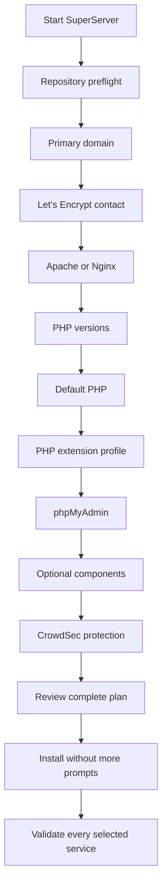

<div align="center">

# ⚡ SNYT SuperServer

### Deploy • Secure • Validate

A modern interactive Multi-PHP web-stack installer for Ubuntu and Debian.


</div>

> One readable installer, one small assets folder, generated private credentials, and a complete validation pass before success is reported.

---

## ✨ What is new in 3.4.0

- Direct `packages.sury.org/php` integration for true Multi-PHP on supported Ubuntu and Debian codenames.
- PHP 8.1, 8.2, 8.3, 8.4 and 8.5 selection.
- PHP extension profiles: **Essential**, **All**, and **Custom**.
- Every user choice is collected before the service installation begins.
- Real Let’s Encrypt email or **no-email registration**; fake/random email addresses are never generated.
- Optional phpMyAdmin while keeping the permanent `/phpmyadmin/` path.
- Optional MariaDB, Redis, Composer, Node.js, PM2, Python, Java, Docker, unattended updates and SNYT MOTD.
- CrowdSec replaces Fail2ban.
- Optional Nginx AppSec/WAF in addition to the CrowdSec firewall bouncer.
- Installation plan saved to `/root/SNYT/install-plan.conf`.
- `super-server` health and management helper.
- Subdomains automatically inherit the main Let’s Encrypt email/no-email choice.

---

## 🧭 Installer flow



The small repository preflight happens before the questionnaire so SuperServer can display **real package availability**. No web stack, database, or optional service is installed until the final plan is approved.

---

## 🐘 Multi-PHP

SuperServer checks and can install:

| PHP | Status label | Default behavior |
|---|---|---|
| 8.1 | Legacy / EOL | Explicit selection only |
| 8.2 | Compatibility | Included by `all` when available |
| 8.3 | Supported | Included by `all` |
| 8.4 | Supported | Included by `all` |
| 8.5 | Newest | Recommended default |

Examples:

```text
2
2,3,4
2-5
all
all+legacy
```

`all` excludes PHP 8.1. Use option `1`, a range containing it, or `all+legacy` when an old application genuinely requires it.

### PHP-FPM only

Apache and Nginx both use PHP-FPM sockets. SuperServer intentionally does **not** install `libapache2-mod-php`, avoiding two competing PHP handlers and preserving per-domain PHP selection.

---

## 🧩 PHP extension profiles

### Essential

```text
cURL, MySQL, Mbstring, XML, ZIP, Intl, GD,
BCMath, OPcache and Readline
```

### All

Essential plus:

```text
Redis, SQLite3, SOAP, BZip2, Imagick, Tidy,
XML-RPC, GMP, LDAP, IMAP, SNMP and APCu
```

### Custom

The installer displays a numbered menu and accepts selections such as:

```text
1-10,12,15
```

Core packages are always installed:

```text
phpX.Y-cli
phpX.Y-common
phpX.Y-fpm
```

Some familiar names are grouped correctly:

- `phpX.Y-xml` supplies DOM, SimpleXML, XML and XSL.
- `phpX.Y-common` supplies common built-ins such as ctype, fileinfo, iconv and tokenizer.

---

## 🌐 Apache or Nginx

| Feature | Apache | Nginx |
|---|---:|---:|
| `.htaccess` | ✅ | — |
| PHP-FPM per domain | ✅ | ✅ |
| Reverse proxy use | Good | Excellent |
| CrowdSec firewall protection | ✅ | ✅ |
| CrowdSec AppSec/WAF | Firewall mode | Optional Nginx mode |

---

## 🛡️ CrowdSec

Security choices are collected in the initial wizard:

```text
1) CrowdSec Security Engine + firewall bouncer
2) CrowdSec + firewall bouncer + Nginx AppSec/WAF
3) No CrowdSec
```

For Apache, SuperServer installs the Security Engine, Apache log collection and firewall bouncer. For Nginx, AppSec can additionally inspect HTTP requests for application-layer attacks.

CrowdSec configuration and metrics:

```bash
cscli metrics
cscli decisions list
systemctl status crowdsec
systemctl status crowdsec-firewall-bouncer
```

---

## 🔐 Let’s Encrypt

The wizard offers:

```text
1) Real email address
2) No email address
```

Subdomains use the same choice automatically:

```bash
super-sdomain app.example.com 8.4
```

The helper reads:

```text
SSL Registration Mode
SSL Email
```

from:

```text
/root/SNYT/serverInfo.txt
```

---

## 🗃️ phpMyAdmin

phpMyAdmin is optional, but when installed its path always stays:

```text
https://example.com/phpmyadmin/
```

It uses the selected default PHP-FPM version. Selecting phpMyAdmin automatically enables MariaDB.

---

## 📦 Optional components

```text
MariaDB
Redis Server
Composer
Node.js and npm
PM2
Python development tools
Java JDK
Docker Engine and Compose
Automatic security updates
SNYT Fastfetch and MOTD
```

Presets:

```text
recommended
all
none
```

---

## 🚀 Installation

```bash
sudo -i
cd /root
curl -fsSL https://raw.githubusercontent.com/abdomuftah/SuperServer/main/SuperServer.sh -o SuperServer.sh
chmod 700 SuperServer.sh
bash -n SuperServer.sh
./SuperServer.sh
```

Run inside Screen for unstable SSH connections:

```bash
screen -S superserver
./SuperServer.sh
```

Detach with `Ctrl+A`, then `D`. Return with:

```bash
screen -r superserver
```

---

## ➕ Add another domain

```bash
super-sdomain app.example.com
super-sdomain app.example.com 8.2
super-sdomain --list-php
```

Every new domain receives:

- A modern `index.php` page.
- Its own Apache VirtualHost or Nginx server block.
- A selected PHP-FPM socket.
- Let’s Encrypt using the main server’s stored contact mode.

---

## 🧰 Management helper

```bash
super-server
super-server status
super-server doctor
super-server domains
super-server php
super-server ssl
super-server restart
super-server info
```

`super-server info` automatically redacts password lines.

---

## 📁 Important paths

| Purpose | Path |
|---|---|
| Credentials and server details | `/root/SNYT/serverInfo.txt` |
| Approved installation plan | `/root/SNYT/install-plan.conf` |
| Additional domain log | `/root/SNYT/domains.txt` |
| Installer log | `/var/log/snyt-superserver.log` |
| Shared templates | `/usr/local/share/snyt-superserver/` |
| Domain helper | `/usr/local/sbin/super-sdomain` |
| Management helper | `/usr/local/sbin/super-server` |

Keep `/root/SNYT/serverInfo.txt` private. It may contain generated MariaDB credentials.

---

## ✅ Validation

Before announcing success, SuperServer validates:

- Every selected PHP CLI binary.
- Every PHP-FPM service and socket.
- Selected PHP extensions.
- The default CLI PHP version.
- PHP served through Apache or Nginx.
- Web-server configuration syntax.
- Selected MariaDB, Redis, Node.js, Python, Composer and Docker components.
- CrowdSec when selected.
- Let’s Encrypt renewal with a dry run after successful issuance.

---

## 🧪 Recommended test matrix

```text
Ubuntu 26.04 + Nginx + PHP 8.2/8.3/8.4/8.5
Ubuntu 26.04 + Apache + PHP 8.2/8.4/8.5
Ubuntu 24.04 + Nginx + Essential modules
Ubuntu 24.04 + Apache + All modules
No-email SSL mode
phpMyAdmin disabled
CrowdSec firewall mode
Nginx CrowdSec AppSec mode
Docker selected and unselected
```

Take a clean VM snapshot before every test.

---

## 📚 Upstream references

- [Sury PHP repository instructions](https://packages.sury.org/php/README.txt)
- [CrowdSec Linux installation](https://docs.crowdsec.net/u/getting_started/installation/linux/)
- [CrowdSec firewall bouncer](https://docs.crowdsec.net/u/bouncers/firewall/)
- [CrowdSec Nginx bouncer](https://docs.crowdsec.net/u/bouncers/nginx/)
- [Certbot documentation](https://eff-certbot.readthedocs.io/en/stable/using.html)
- [PHP supported versions](https://www.php.net/supported-versions.php)

---

<div align="center">

Built with care by **SNYT Hosting**

</div>
