<div align="center">

# ⚡ SNYT SuperServer

### A clean, interactive Multi-PHP web-stack installer for Ubuntu and Debian

Choose **Apache or Nginx**, install one or several **PHP-FPM versions**, secure the server, and validate every service before completion.

[](CHANGELOG.md)
[](SuperServer.sh)
[](#-supported-systems)
[](#-supported-systems)

<br>

> One readable installer, a small assets folder, private generated credentials, clear logs, and no hidden control panel.

</div>

---

## ✨ Highlights

<table>
<tr>
<td width="50%" valign="top">

### 🌐 Web stack

- Friendly **Apache / Nginx** selection
- **Multi-PHP FPM** installation
- Per-domain PHP version selection
- MariaDB and phpMyAdmin
- Redis
- Certbot with automatic renewal

</td>
<td width="50%" valign="top">

### 🛡️ Security

- UFW firewall
- Automatic SSH-port detection
- Fail2ban
- unattended-upgrades
- Random database credentials
- Private files with restricted permissions

</td>
</tr>
<tr>
<td width="50%" valign="top">

### 🧰 Development tools

- Composer
- Node.js LTS and PM2
- Python, pip and Django
- Java Development Kit
- Git and common build tools

</td>
<td width="50%" valign="top">

### 🖥️ Server experience

- Modern installation welcome screen
- SNYT Fastfetch MOTD
- Modern dynamic `index.php` template
- Detailed installation log
- Final runtime validation
- `super-sdomain` helper

</td>
</tr>
</table>

---

## 🆕 Version 3.3.1

### Visible PHP choices with live availability

SuperServer always displays the full PHP choice list instead of hiding versions that are unavailable on the current operating system:

```text
PHP version selection

1) PHP 8.1  [UNAVAILABLE]  legacy compatibility
2) PHP 8.2  [UNAVAILABLE]  wide compatibility
3) PHP 8.3  [UNAVAILABLE]  modern compatibility
4) PHP 8.4  [UNAVAILABLE]  modern release
5) PHP 8.5  [AVAILABLE]    newest candidate (recommended available version)

Examples: 2 | 2,4 | 2-5 | all
PHP versions to install [all]:
```

The status is detected live after compatible repositories are configured:

- **AVAILABLE** means CLI, FPM and every required core extension can be installed safely.
- **UNAVAILABLE** means at least one required package is missing on the current OS/repository combination.
- Selecting an unavailable option is rejected and then shows the exact missing-package list.
- `all` installs every version currently marked **AVAILABLE**.

On systems where multiple complete versions exist, SuperServer installs all selected PHP-FPM services in one run.

When several versions are selected, you choose one default version for:

- The PHP CLI
- The primary domain
- phpMyAdmin

Every additional domain can use any active PHP-FPM socket independently.

> [!NOTE]
> Every supported PHP choice is displayed. Only versions marked **AVAILABLE** can be selected. Package availability still depends on the operating system and compatible repositories.

### Automatic SSL email for new domains

`super-sdomain` no longer asks for a Let's Encrypt email. It reads the same address used by the primary domain from:

```text
/root/SNYT/serverInfo.txt
```

Examples:

```bash
super-sdomain app.example.com
super-sdomain app.example.com 8.3
super-sdomain --list-php
```

### Modern starter page

Every new domain receives a responsive `index.php` page showing useful, non-sensitive runtime details:

- Domain and hostname
- Operating system
- Web server and PHP runtime
- Memory and disk utilization
- System load and uptime
- HTTPS status
- Document root and useful server paths

The template never displays database passwords or other secrets.

---

## ✅ Supported systems

| Distribution | Releases | Architecture |
|---|---|---|
| Ubuntu Server | 22.04 LTS, 24.04 LTS, 26.04 LTS | amd64; arm64 where packages exist |
| Debian | 11, 12, 13 | amd64; arm64 where packages exist |

SuperServer automatically detects the distribution, codename, architecture and active SSH port.

External repositories are enabled only when release metadata exists for the detected codename. Otherwise, the installer safely uses distribution packages.

> [!IMPORTANT]
> Start on a clean VM and take a snapshot before testing a new release. The Nginx + PHP 8.5 path was validated on Ubuntu 26.04; other operating-system and web-server combinations should still be tested before production deployment.

---

## 🚀 Installation

```bash
sudo -i
wget https://link.snyt.xyz/SuperServer -O SuperServer.sh
chmod 700 SuperServer.sh
bash -n SuperServer.sh
./SuperServer.sh --version
screen -S superserver
./SuperServer.sh
```

Detach from `screen` without stopping installation:

```text
Ctrl+A, then D
```

Return later:

```bash
screen -r superserver
```

---

## 🧭 Installation flow

```mermaid
flowchart LR
    A[Detect OS and SSH] --> B[Primary domain and SSL email]
    B --> C[Choose Apache or Nginx]
    C --> D[Discover complete PHP versions]
    D --> E[Select one or multiple PHP versions]
    E --> F[Choose default PHP]
    F --> G[Install web stack and tools]
    G --> H[Issue SSL and harden server]
    H --> I[Validate all PHP-FPM services]
    I --> J[Ready]
```



---

## 🐘 Multi-PHP behavior

SuperServer validates these packages before marking a PHP version **AVAILABLE**:

```text
phpX.Y-cli
phpX.Y-common
phpX.Y-fpm
phpX.Y-curl
phpX.Y-mysql
phpX.Y-mbstring
phpX.Y-xml
phpX.Y-zip
phpX.Y-intl
phpX.Y-gd
phpX.Y-bcmath
```

OPcache is installed as a separate package where provided, or validated as a built-in module when the distribution bundles it with PHP.

Optional extensions are installed when available:

```text
redis sqlite3 soap bz2 imagick tidy
```

Apache and Nginx both route each domain directly to its selected FPM socket:

```text
/run/php/php8.2-fpm.sock
/run/php/php8.3-fpm.sock
/run/php/php8.4-fpm.sock
/run/php/php8.5-fpm.sock
```

### Check installed versions

```bash
super-sdomain --list-php
ls -l /run/php/php*-fpm.sock
```

### Change the default CLI manually

```bash
update-alternatives --config php
```

Changing the CLI default does not change an existing domain's FPM socket.

---

## 🌍 Add a domain or subdomain

Interactive:

```bash
super-sdomain
```

Specify a domain:

```bash
super-sdomain app.example.com
```

Specify a domain and PHP version:

```bash
super-sdomain app.example.com 8.3
```

The helper automatically:

1. Reads the SSL email from `/root/SNYT/serverInfo.txt`.
2. Creates the document root and modern starter page.
3. Builds the Apache VirtualHost or Nginx server block.
4. Routes PHP to the selected FPM socket.
5. Validates and reloads the web server.
6. Requests a Let's Encrypt certificate.
7. Uses locally installed templates from `/usr/local/share/snyt-superserver`.
8. Records the domain in `/root/SNYT/domains.txt`.

---

## 📁 Important paths

| Purpose | Path |
|---|---|
| Credentials and installation details | `/root/SNYT/serverInfo.txt` |
| Added-domain history | `/root/SNYT/domains.txt` |
| Installation state | `/root/SNYT/.superserver-installed` |
| Installation log | `/var/log/snyt-superserver.log` |
| Website roots | `/var/www/html/<domain>` |
| Add-domain helper | `/usr/local/sbin/super-sdomain` |
| Local domain templates | `/usr/local/share/snyt-superserver` |
| SNYT Fastfetch configuration | `/etc/snyt/fastfetch.jsonc` |

Protect the credentials file:

```bash
chmod 600 /root/SNYT/serverInfo.txt
```

Display it with passwords hidden:

```bash
sed -E '/[Pp]assword:/s/:.*/: [REDACTED]/' /root/SNYT/serverInfo.txt
```

---

## 🔍 Validation commands

```bash
systemctl --failed --no-pager
nginx -t                 # Nginx installations
apache2ctl configtest    # Apache installations
systemctl status 'php*-fpm' --no-pager
redis-cli ping
fail2ban-client status
ufw status verbose
certbot certificates
certbot renew --dry-run
```

Check a specific PHP version:

```bash
php8.3 -v
php8.3 -m
systemctl status php8.3-fpm --no-pager
```

---

## 🧪 Current validation status

| System | Web server | PHP | Status |
|---|---|---|---|
| Ubuntu 26.04 | Nginx | PHP 8.5 FPM | ✅ Full installation passed |
| Ubuntu 26.04 | Apache | PHP 8.5 FPM | ⏳ Pending |
| Ubuntu 24.04 | Nginx | Multi-PHP | ⏳ Pending |
| Ubuntu 24.04 | Apache | Multi-PHP | ⏳ Pending |
| Debian targets | Apache/Nginx | Available PHP versions | ⏳ Pending |

---

## 🧯 Troubleshooting

### Review the installer log

```bash
tail -n 200 /var/log/snyt-superserver.log
```

### SSL did not issue

Confirm DNS points to the server and TCP ports 80/443 are reachable, then run:

```bash
certbot --nginx --email "$(awk -F': ' '$1=="SSL Email"{print $2}' /root/SNYT/serverInfo.txt)" -d example.com --redirect
```

Use `--apache` instead of `--nginx` on Apache installations.

### A PHP version is marked unavailable

Inspect package availability:

```bash
apt-cache policy php8.3-cli php8.3-fpm php8.3-mysql
```

A version remains visible but is marked **UNAVAILABLE** when any required package is missing. The installer prints the missing packages and refuses unsafe selection.

### Previous installation guard

```bash
./SuperServer.sh --force
```

Use `--force` only after a snapshot or backup. It does not safely convert an existing Apache installation into Nginx or the reverse.

---

## 🗂️ Repository layout

```text
SuperServer/
├── SuperServer.sh
├── README.md
├── CHANGELOG.md
└── assets/
    ├── index.php
    ├── ApacheExample.conf
    ├── nginxExample.conf
    ├── apache_setup.sh
    ├── nginx_setup.sh
    ├── Apachejail.local
    ├── Nginxjail.local
    └── php.ini
```

---

<div align="center">

Built for **SNYT Hosting** ⚡

</div>
